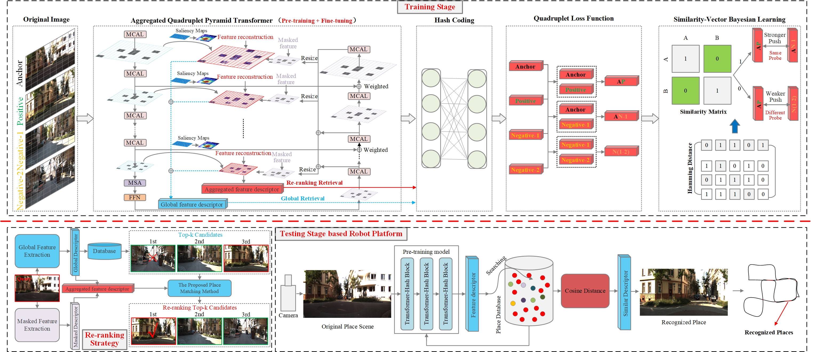

# Quadruplet Transformer for Robot Place Recognition

This repository contains the implementation of the paper: **"Quadruplet Transformer Modeling with Weighted Multi-Level Attention Aggregation for Robot Place Recognition"**. This work leverages a Vision Transformer (ViT) backbone with multi-level attention aggregation and a quadruplet loss function for robust large-scale visual place recognition tasks.



## Table of Contents

- [Introduction](#introduction)
- [Installation](#installation)
- [Usage](#usage)
  - [Training](#training)
  - [Testing](#testing)
- [Configuration](#configuration)


## Introduction

Visual place recognition (VPR) is a key problem in robotics and computer vision, where the goal is to determine whether a current scene has been previously visited. The proposed **Aggregated Quadruplet Pyramid Transformer (AQPT)** architecture offers enhanced performance by integrating multi-channel attention and utilizing a quadruplet loss function with Bayesian learning.

## Installation

### Prerequisites

Make sure you have the following dependencies installed:

- Python 3.7+
- PyTorch 1.9+
- torchvision 0.10+
- transformers
- NumPy
- Pillow (PIL)
- scikit-learn

### Install Dependencies

To install the required packages, run:

```bash
pip install -r requirements.txt
```
### training
Once the model is trained, you can evaluate its performance on the test set using the test.py script:
```bash
python train.py --model checkpoints/aqpt_model.pth --dataset data/KITTI/test/
```
### Testing
Once the model is trained, you can evaluate its performance on the test set using the test.py script:
```bash
python test.py --model checkpoints/aqpt_model.pth --dataset data/KITTI/test/
```
Arguments:

--model: Path to the saved model checkpoint.

--dataset: Path to the test dataset directory.

The script outputs evaluation metrics such as recall, precision, and visualizes the place recognition results.
              
In addition, if you want to run the code, please ensure you have the necessary datasets (e.g., [KITTI](https://www.cvlibs.net/datasets/kitti/), [EuRoc](), [VPRICE](), [Nordland](https://nrkbeta.no/2013/01/15/nordlandsbanen-minute-by-minute-season-by-season/)) available for training and evaluation.

# real-world experimental

To build and implement a real-world experimental setup for evaluating the AQPT model in visual place recognition tasks, you would typically need a robot platform, like the Jetson Xavier NX, equipped with cameras for data collection and an onboard processing unit for running the model. Here's a general structure for setting up the experiment and the code implementation to run AQPT.

## Hardware Setup

-Robot Platform: A mobile robot platform equipped with Jetson Xavier NX or a similar GPU-enabled board.

-Camera: A stereo camera or monocular camera to capture real-time images during navigation (e.g., Intel RealSense, ZED camera).

-Sensor: (Optional) Additional sensors like IMU or GPS for localization.

-Software Setup

OS: Ubuntu with ROS (Robot Operating System) for robot control and data processing.

1. Deep Learning Libraries: Install PyTorch or TensorFlow on the Jetson Xavier NX for running the AQPT model.
2. Real-time Data Capture: Use ROS to capture and publish image data from the robot's camera in real-time.
3. Steps for Building the Real-world Experiment 

### Robot Platform Preparation:

-Set up the Jetson Xavier NX with a camera mounted on the robot.

-Install the necessary drivers for the camera and configure ROS for image capture.

-Data Collection:

Capture real-time images from the environment as the robot navigates in different scenarios (e.g., day and night).
Store these images for both training and testing.
Preprocessing:

Convert captured images to the appropriate size (e.g., $256\times256$) and format (RGB).
Normalize the images before feeding them into the model.

## Python Code Implementation

### AQPT Model Inference Setup

This code snippet demonstrates how to load a pre-trained **Aggregated Quadruplet Pyramid Transformer (AQPT)** model and prepare it for inference using PyTorch. The model is loaded with pre-trained weights, and a series of image preprocessing transformations is defined to normalize the input images.

#### Dependencies

- `torch` (PyTorch)
- `torchvision.transforms`
- `PIL` (Python Imaging Library)

#### Code Explanation

Import Required Libraries

```python
import torch
import torchvision.transforms as transforms
from PIL import Image
```
Load the Pre-trained AQPT Model

```python
# Load pre-trained AQPT model (assuming the model is implemented in AQPT.py)
from AQPT import AQPTModel  # Import your AQPT model

# Load the pre-trained weights for AQPT
model = AQPTModel()
model.load_state_dict(torch.load('aqpt_pretrained_weights.pth', map_location='cuda'))
model = model.to('cuda')
model.eval()
```
Here, the pre-trained AQPT model is imported and loaded with the saved weights (aqpt_pretrained_weights.pth). The model is moved to the GPU for efficient inference using model.to('cuda') and set to evaluation mode with model.eval().

Image Preprocessing

```python
# Define image preprocessing transformations
transform = transforms.Compose([
    transforms.Resize((256, 256)),
    transforms.ToTensor(),
    transforms.Normalize(mean=[0.485, 0.456, 0.406], std=[0.229, 0.224, 0.225]),
])
```
### Usage
To use the pre-trained AQPT model for inference, pass images through the preprocessing pipeline and then feed them into the model for predictions. The model is prepared for running on a CUDA-enabled device for better performance.

```python
# Example usage of the transformation and model inference
img = Image.open('input_image.png')
input_tensor = transform(img).unsqueeze(0).to('cuda')  # Preprocess and send to GPU

# Perform inference
with torch.no_grad():
    output = model(input_tensor)

# Output is the model's prediction for the input image
print(output)
```

